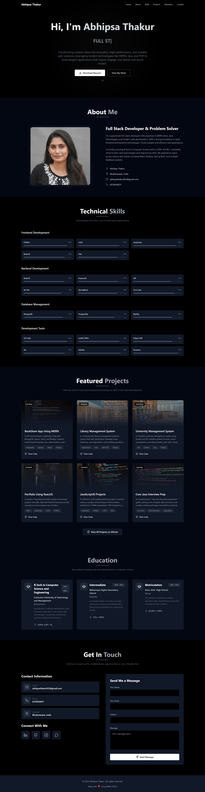

# 🚀 Portfolio Using MERN

A modern, full-stack **developer portfolio application** built using the **MERN stack**.  
This project highlights my skills in **frontend UI development**, **backend API design**, and **real-world features** like email notifications — following clean code practices and a modular architecture.

---

## 🛠️ Tech Stack

### Frontend
- React.js
- JavaScript (ES6+)
- HTML5
- CSS3
- Tailwind CSS

### Backend
- Node.js
- Express.js

### Database
- MongoDB  


### Tools & Platforms
- Git & GitHub
- VS Code
  

---

## ✨ Key Highlights

- 📱 Fully responsive and modern UI
- ⚛️ Component-based React architecture
- 🔗 RESTful backend APIs
- 📂 Clean and organized folder structure
- 🚀 Scalable and maintainable codebase
- 💼 Built with real-world portfolio use-cases in mind

---

## 🌟 Features

### 📩 Smart Contact Form
- When a user submits the contact form:
  - ✅ **Admin receives an email notification** with user details.
  - 📧 **User receives a confirmation email**, acknowledging their message.
- Real-world email workflow using backend services.

### 🎨 UI & UX
- Mobile-first responsive design
- Clean layout with smooth user experience
- Easy customization for future updates

---

## 🖼️ Portfolio Screenshot



---

## ⚙️ Setup Instructions

### Frontend
```bash
cd frontend
npm install
npm start
```
### Backend
```bash
cd backend
npm install
node server.js
```
